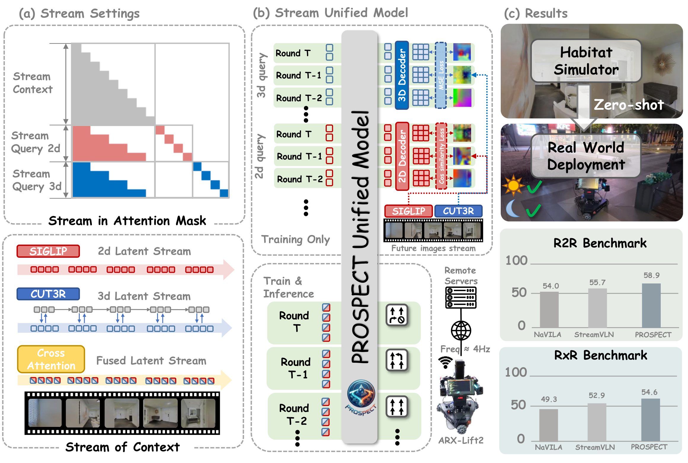

<div align="center">

# PROSPECT

**Unified Streaming Vision-Language Navigation via Semantic–Spatial Fusion and Latent Predictive Representation**

[](https://arxiv.org/abs/2603.03739)
[](https://arxiv.org/pdf/2603.03739)
[](https://github.com/Debactor/PROSPECT)

<a href="https://arxiv.org/abs/2603.03739">📄 Paper</a> ·
<a href="https://github.com/Debactor/PROSPECT">💻 Code</a>

</div>

<p align="center">
  
</p>

<p align="center">
  <em>Overview of PROSPECT.</em>
  (a) Streaming setup: a causal attention mask isolates 2D/3D query tokens; SigLIP and CUT3R features are fused by cross-attention.
  (b) Unified model: stream query tokens predict next-step 2D/3D latents during training only; inference runs the VLA policy at ~4 Hz.
  (c) First-tier VLN-CE results and zero-shot real-robot deployment under diverse lighting.
</p>

---

## 🌟 Overview

**PROSPECT** (Predictive Representations Of SPatial-sEmantic ContexTs) is a unified streaming VLN agent that couples a streaming Vision-Language-Action (VLA) policy with **latent predictive representation** learning.

- 🔗 **Semantic–spatial fusion** — SigLIP 2D semantics and CUT3R absolute-scale 3D features are fused by cross-attention
- 🧠 **Latent world model** — stream query tokens predict next-step 2D/3D features in frozen teacher spaces (no pixels / no extra inference cost)
- 📡 **Long-context streaming** — CUT3R provides streaming, absolute-scale spatial features suited for long-horizon navigation
- 🤖 **Ready to deploy** — SFT training and Habitat closed-loop evaluation on **R2R** and **RxR**; real-robot control at ~4 Hz

This repo releases the Stage-1 SFT recipe and Habitat evaluation. See the [paper](https://arxiv.org/abs/2603.03739) for full method and results.

## 📣 News

- `[2026.08]` Release training and Habitat closed-loop evaluation code for PROSPECT.

## 🛠️ Installation

Python 3.9 · PyTorch 2.4 · CUDA 12.x · 4+ GPUs recommended for training.

```bash
conda create -n prospect python=3.9
conda activate prospect

# Habitat-Sim
conda install habitat-sim==0.2.4 withbullet headless -c conda-forge -c aihabitat

# Habitat-Lab v0.2.4
git clone --branch v0.2.4 https://github.com/facebookresearch/habitat-lab.git
cd habitat-lab && pip install -e habitat-lab && pip install -e habitat-baselines && cd ..

# This repo
git clone https://github.com/Debactor/PROSPECT.git prospect && cd prospect
pip install -r requirements.txt
pip install flash-attn --no-build-isolation   # optional

# CUT3R (spatial encoder)
git clone https://github.com/CUT3R/CUT3R.git
pip install -r CUT3R/requirements.txt

export PYTHONPATH="$(pwd):${PYTHONPATH}"
```

## 🦁 Pretrained Weights

| Model | Link | Usage |
|-------|------|--------|
| LLaVA-Video-7B-Qwen2 | [Hugging Face](https://huggingface.co/lmms-lab/LLaVA-Video-7B-Qwen2) | Training init (`PREV_STAGE_CHECKPOINT`) |
| SigLIP | [google/siglip-so400m-patch14-384](https://huggingface.co/google/siglip-so400m-patch14-384) | Vision tower (auto-download) |
| CUT3R | [blanchon/CUT3R](https://huggingface.co/blanchon/CUT3R) | Auto-download to `checkpoints/cut3r/`; or set `CUT3R_WEIGHTS_PATH` |

## 📦 Data Preparation

Create a `data/` directory under the repo root:

```text
data/
├── scene_datasets/mp3d/          # Matterport3D meshes
├── datasets/
│   ├── r2r/{split}/{split}.json.gz
│   └── rxr/
│       ├── {split}/{split}_guide.json.gz
│       └── val_unseen/val_unseen_guide_gt.json.gz   # RxR nDTW
└── trajectory_data/
    ├── R2R/                      # images/ + annotations.json
    ├── RxR/
    └── EnvDrop/                  # training only (not used for eval)
```

**1. Scene meshes** — Download [Matterport3D](https://niessner.github.io/Matterport/) into `data/scene_datasets/mp3d/`.

**2. VLN-CE episodes (evaluation)**

| Benchmark | Download | Extract to |
|-----------|----------|------------|
| R2R | [link](https://drive.google.com/file/d/18DCrNcpxESnps1IbXVjXSbGLDzcSOqzD/view) | `data/datasets/r2r/` (rename `R2R_VLNCE_v1` → `r2r`) |
| RxR | [link](https://drive.google.com/file/d/145xzLjxBaNTbVgBfQ8e9EsBAV8W-SM0t/view) | `data/datasets/rxr/` (rename `RxR_VLNCE_v0` → `rxr`) |

**3. Trajectory data (training)** — We use the pre-collected observation–action trajectories generously released by **[StreamVLN](https://github.com/OpenRobotLab/StreamVLN)**. Their README already documents the download steps and expected directory layout in detail — please **⭐ star** their repo and follow their [data preparation guide](https://github.com/OpenRobotLab/StreamVLN#data-preparation) rather than reinventing the process. Download from [StreamVLN-Trajectory-Data](https://huggingface.co/datasets/cywan/StreamVLN-Trajectory-Data) into `data/trajectory_data/`. Each of `R2R`, `RxR`, `EnvDrop` should contain `annotations.json` and per-episode `rgb/` frames.

## 🚀 Training

Stage-1 SFT on R2R + RxR + EnvDrop trajectories, with CUT3R + SigLIP fusion and latent 2D/3D world-model loss (DeepSpeed ZeRO-2, 1 epoch):

```bash
export DATA_ROOT=./data
export PREV_STAGE_CHECKPOINT=lmms-lab/LLaVA-Video-7B-Qwen2
export OUTPUT_DIR=./checkpoints/prospect

bash scripts/prospect_train.sh
```

Checkpoints are written to `OUTPUT_DIR`.

## 📊 Evaluation

Closed-loop Habitat evaluation on **R2R** and **RxR**:

```bash
export CHECKPOINT=./checkpoints/prospect/checkpoint-XXXX
export DATA_ROOT=./data

bash scripts/prospect_eval.sh r2r    # val_unseen by default
bash scripts/prospect_eval.sh rxr
```

Optional: `EVAL_SPLIT=val_seen`. Results go to `results/{r2r|rxr}_${EVAL_SPLIT}/`.

Configs: [`config/vln_r2r_eval.yaml`](config/vln_r2r_eval.yaml), [`config/vln_rxr_eval.yaml`](config/vln_rxr_eval.yaml).

## ✒️ Citation

If you find this work useful, please consider starring ⭐ this repo and citing:

```bibtex
@article{fan2026prospect,
  title={PROSPECT: Unified Streaming Vision-Language Navigation via Semantic--Spatial Fusion and Latent Predictive Representation},
  author={Fan, Zehua and Lyu, Wenqi and Song, Wenxuan and Zhao, Linge and Yang, Yifei and Wang, Xi and He, Junjie and Huang, Lida and Liu, Haiyan and Sun, Bingchuan and Bao, Guangjun and Mao, Xuanyao and Xu, Liang and Wang, Yan and Gao, Feng},
  journal={arXiv preprint arXiv:2603.03739},
  year={2026}
}
```

Paper: [arXiv:2603.03739](https://arxiv.org/abs/2603.03739)

## 🙏 Acknowledgements

We thank the following open-source projects that this work builds upon:

- [StreamVLN](https://github.com/OpenRobotLab/StreamVLN)
- [LLaVA-NeXT](https://github.com/LLaVA-VL/LLaVA-NeXT)
- [CUT3R](https://github.com/CUT3R/CUT3R)
- [Habitat-Lab](https://github.com/facebookresearch/habitat-lab)
